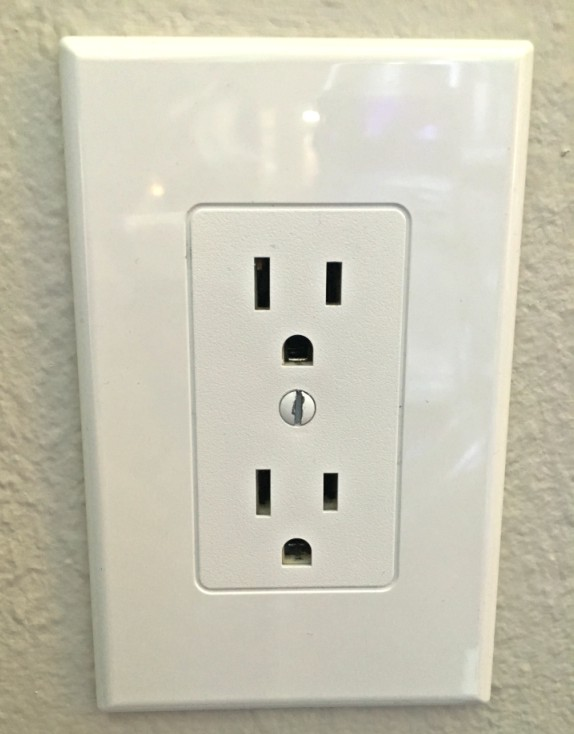

# Software Architecure

### Description

Software Architecture is the *blueprint* of a sytstem. It will define such things as:

- Performance
- Modifiability
- Security

I see it as the structure of a system and **does not** define technologies used. For example, you may say that we are using an MV* architecture, but nowhere in the report should you mention that we are using Angular2 for this...

Software Architecture defines the relationships of elements within a system

> *"What is software design?"* "The final goal of any engineering activity is some type of documentation (*blueprint*)" - (Reeves, 1992)

In manufacturing world, using atoms which are very hard to change but in software, dealing with bits which are very maluable

Software Manufactuing = Compilation/Deployment

Design Document (blueprint) = Source Code

> "Given that software designs are relatively easy to turn out and essentially free to build, an unsurprising revelation is that software designs tend to be incredibly large and complex" - *(Reeves, 1992)*

For example, in traditional manufacturing, have to make sure that loads of money thrown into it to make it secure as it would be too ridiculous to watch a heavy vehicle roll over a bridge and watch it collapse and then go "well we need to build a better bridge next time". In software, tests/changes are incredibly cheap.

### Hybrids

On some occasions, 1 architecture pattern will not solve all problems. For example, you could maybe see that Pipes & Filters can solve 80% of your problems and cover the use cases but what about the extra 20%? You could try and find a way to force your business rules/logic to fit into a Pipes & Filters architecture **or** you could use another pattern. You, as an architect, have to make that executive decision.

What I want to get across here is that you do not just have to use **1** pattern for every system. Hybrids can be created and you will see throughout this section that an advantage of some patterns *(i.e. microkernel)* is that they are easily embedded into other patterns.

***

### Physical Constraints

##### Traditional manufacturing

Take this electrical socket cover  If that cover does not completely cover the whole in the wall, then nothing drastic will happen to the overall architecture of the building.

##### Software

In the software world (in terms of compilation), 1 wrong piece of code can make the code not compile & kill the project so our tolerance for errors is small compared to the real world.

***

### Cause & Effect

##### Traditional manufacturing

If a wing fell off of an aeroplane, you would probably go to the place on the plane where it fell off to try and figure it out

##### Software

You can call some instability to happen that won't manifest for hundreds of lines of codes so is very hard to track down where the problem might lie

***

### Economy & Scale

##### Traditional manufacturing

In the golden gate bridge, there are more 1 million+ rivets & people who understand structural integrity of bridges will be able to tell you what each one is for.

##### Software

May have hundreds/thousands little pieces *(components)* but each 1 of them is a handcrafted little piece *(little/no commonality)* so do not have same level of componentisation that the real world has.

In traditional manufacturing, many hours/lots of money goes into predictability to try and ensure that the thing does what it is supposed to do. That is not required in software world as *(compilation is so cheap)* we would be better off writing tests for the code we write...

**Testing = engineering rigor in software**

> *"Software may be cheap to build, but it is *incredibly* expensive to design"* - **(Reeves, 1992)**

***

## Styles and Patterns

The terms of architectural styles & architectural patterns are commonly used interchangeably. Some sources (i.e. [MSDN](https://msdn.microsoft.com/en-us/library/ee658117.aspx?ranMID=24542&ranEAID=TnL5HPStwNw&ranSiteID=TnL5HPStwNw-fOBnxMTYDA5TWBJ8EbAVNg&tduid=(4e04d907e9042f60fa8288fc649e7257)(256380)(2459594)(TnL5HPStwNw-fOBnxMTYDA5TWBJ8EbAVNg)())) agree with this and say the 2 are the same. However, the author decided to differentiate between the 2 purely because the goal of some patterns/styles seem to be different and split into different sections. The author also chose to differentiate here as there are so many patterns/styles to all fit under 1 umbrella terminology so the author found it useful to categorise these differently

If this not a view that is shared you can simply ignore this differentiation :).

To separate these out, the author like to refer to [Fairbanks & Keeling's](http://www.georgefairbanks.com/blog/architecture-patterns-vs-architectural-styles/) definition.

#### Architectural Styles

Keeling used the example of a toolbox in a standard drawing application. Items that you see in the toolbox *(i.e. shapes, paintbrush, selection)* have been defined by the architectural style. The style also tells us as to how these items/modules interact with each other.

Examples of *styles* are:

- Component-based
- Monolithic application
- Layered
- Pipes & Filters
- Event-driven
- Publish-subscribe
- Plugins
- Client-server
- Service-oriented

A style can be implemented in various ways, with specific technical environment, specific policies, frameworks or practices.

#### Architectural Patterns

Keeling proposes that if you think about standard OO programming, the classes & what makes them up *(i.e. properties, methods...)*, you can think of these as your architectural style

> The patterns don't establish the vocabulary [...] of the core elements. They don't define 'client', they don't define 'server', they don't define 'pipe and filter' - **(Fairbanks, 2014)**

Pattern is a recurring solution to a recurring problem. In the case of Architectural Patterns, they solve the problems related to the Architectural Style. I.e:

> *"What classes will we have and how will they interact, in order to implement a system with a specific set of layers?""
> *"What high-level modules will we have in our Service-Oriented Architecture and how will they communicate?"*
> *"How many tiers will our Client-Server Architecture have?"*

Patterns have an extensive impact on the code base, most often impacting the whole application either horizontally *(i.e. how to structure the code inside a layer)* or vertically *(i.e. how a request is processed from the outer layers into the inner layers and back)*.

Example of *patterns* are:

- Three-tier
- Microkernel
- MVC *(Model View Controller)*
  <small><i>Solves the problem of separating UI from the model</i></small>
- MVVM *(Model View View-Model)*
