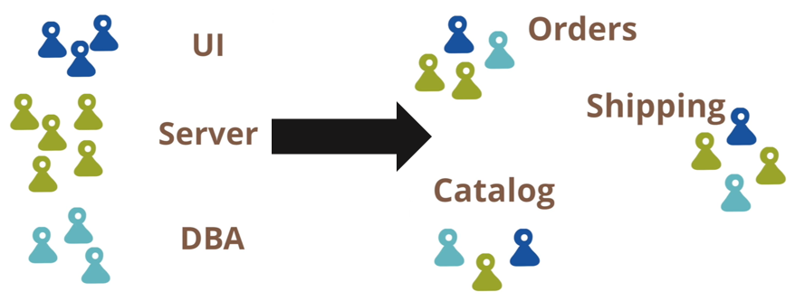
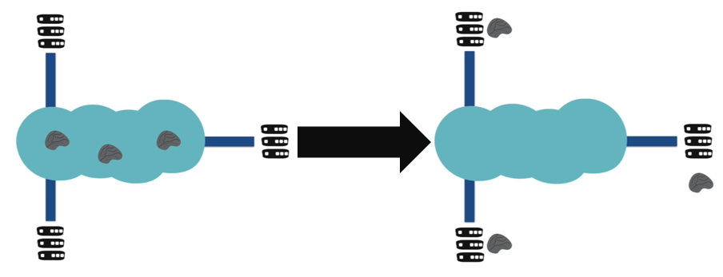

# Microservices

For this section, the author mainly chose to go with [Lewis & Fowler's](https://www.martinfowler.com/microservices/#what) definition and characteristics of microservices as they found it the easiest to understand.

### Definition

> *"[...] The microservice architectural style is an approach to developing a single application as a suite of small services, each running in its own process and communicating with lightweight mechanisms, often an HTTP resource API. These services are built around business capabilities and independently deployable by fully automated deployment machinery. There is a bare minimum of centralized management of these services, which may be written in different programming languages and use different data storage technologies."* - **(Lewis & Fowler, x)**

Comparing a microservices application with a traditional monolithic application is that a traditional monolith has all the capabilities of that application in one process. A microservices application rejects this notion and has characteristics split into multiple processes.

### Characteristics

The author thought that Lewis & Fowler did a great job in defining the characteristics of a typical microservices application. They highlighted 9 major characteristics that each microservices application **should** have. The author will go into depth on what each of these means:

1. [Componentisation via Services](#componentisation-via-services)
2. [Organisation around Business Capabilities](#organisation-around-business-capabilities)
3. [Products not Projects](#products-not-projects)
4. [Smart endpoints & dumb pipes](#smart-endpoints-&-dumb-pipes)
5. [Decentralised Governance](#decentralised-governance)
6. [Decentralised Data Management](#decentralised-data-management)
7. [Infrastructure Automation](#infrastructure-automation)
8. [Design for failure](#design-for-failure)
9. [Evolutionary Design](#evolutionary-design)

##### Componentisation via Services

A component is, as commonly defined, a small piece of software that has low/no cohesion to other components and is, therefore, independently replaceable & upgradeable. Microservices represents a **component** as a **service**. Each **service** is maintained in its own process. Communication between services is done between out-of-process communication facilities *(i.e. web service calls, or remote procedural calls)*.

The benefit of using services here is that they are indpendently; deployable, replaceable, upgradeable... 
They have specifically defined low cohesive boundaries which make them very easy to manage without worrying about knock-on effects to other services which is a common issue in traditional monolithic applications.

***

##### Organisation around Business Capabilities

Traditionally, sofware teams were organised around technology *(i.e. db team ... server team ... UI/UX team)*. Microservices rejects this and says that teams should be organised by capabilities of the business *(i.e. Orders ... Shipping ... Catalog)*. What this means is that there are less of handoffs between teams and that teams see the project from all aspects instead of just their niche expertise.

For example...

In a traditional application, 1 team might be responsible for just maintaining the middleware and db communications and that when UI/UX raises a bug around their order details not formatting correctly, they stay well clear... With microservices, if that same scenario crept up, the team *(service as called here)* responsible for the Order **Business Capability** will step in and handle the bug.

***

#### Products not Projects

Traditionally, projects would use a project model whereby a team would develop some piece of software, ship it, and then hand it off to another team for maintenance and the original team is either disbanded or moves onto their next assignment.

Microservices, again, rejects this and says that a team should own a product for its entire lifespan... designing, developing, maintenance... 
> *"You build it, you run it"* - **(Amazon, x)**

The aim of this is to increase a teams relationship to a product. An analogy could be a parent/guardian... you don't just interact with your child during the early years of life and then cast them aside... you should guide them through early life, care for them up until their time has come, and stick with them when they fall ill *(thought that was quite a nice analogy for bugs there...)*

***

#### Smart endpoints & dumb pipes

In SOA, people usually go down the route of trying to find some really heavy, powerful middleware (the Enterprise Service Bus (ESB)) that is capable of doing all sorts *(i.e. send messages, apply business rules...)* 
Microservices says that these smarts *(business logic, business rules...)* should be on the endpoints *(services)* themselves. 
What is wanted to be achieved is for each service to be connected together and be able to send things across efficiently **but** it should be up to the services themselves on where all these smarts get sent to.

A good example here is the Internet itself...

**YOU** *(the user)* are an endpoint in this context and if you want to send an email to someone... it is **you** who decides who that email goes to. The pipes in this case are just the various amount of network components this email goes through to reach its recipient.

***

#### Decentralised Governance

***

#### Decentalised Data Management

In a traditional monolith, there is 1 database to rule them all *(best LOTR reference ever!)*. 
Shocking but microservices also rejects this notion and says that each service should be responsible for its own data *(have their own data store)* & have its own persistence.

This gives freedom to services on how it stores its data... 
Got a Node backend talking to a Mongo instance? Cool. Want a .NET app speaking to MySQL? Awesome. Even want a basic C++ widget with a flat-file system? Yeah, it can do that too.

Amazon says that services shouldn't be able to talk to each other via the data but throuhg the endpoints that they expose.

***

#### Infrastructure Automation

The clue is in the name:

- Continuous Delivery...
- Blue/Green Deployment...
- Monitoring...

***

#### Design for Failure

This is by far the easiest one to explain. By fact of splitting up the application into several services, this gives greatly defined cohesive boundaries in that each service is independently upgradable, replaceable etc... However... this is also very tricky to implement. If you are going to have independent, remote services with no centralised governance, they are going to fail *(especially when attempting to distribute the application (i.e. incompatibility issues))*

At the most famous level of this characteristic, you have [Netflix's Chaos Monkey](https://netflix.github.io/chaosmonkey/) which intentionally brings down services in an attempt to increase rigor, response time, check level of cohesion *(bringing down 1 service should not bring down another)*.

***

#### Evolutionary Design

