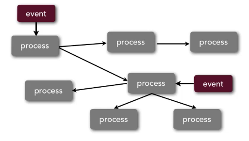

# (Staged) Event-Driven *(EDA)*

 

+ Processes = independent components that push out events to other components. These components are processing that event & then pushing out an event that they did. Events can come in at terminal markers & kick off the whole process...

3 EDA topologies:
  1. [Event processor topology](eda-topologies/event-processor.md)
  2. [Broker topology](eda-topologies/broker.md)
  3. [Broker-less topology](eda-topologies/broker-less.md)

