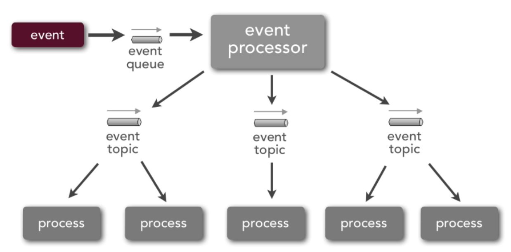
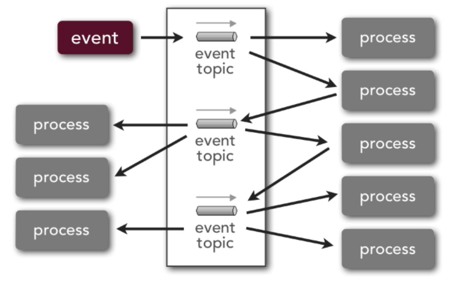
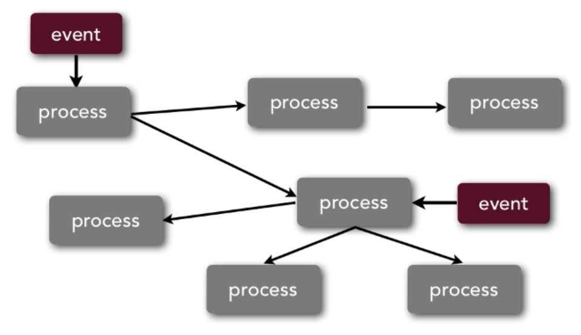
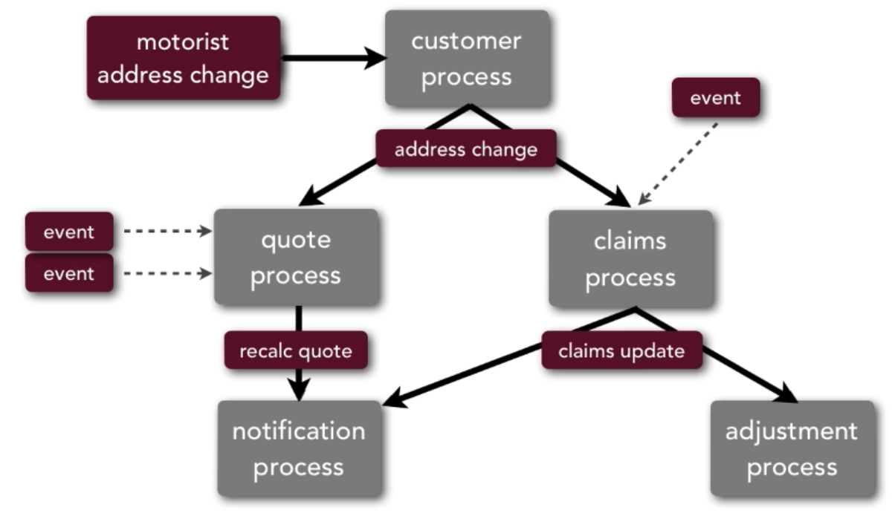

# (Staged) Event-Driven *(EDA)*

- *Events*: These **drive** *(as per the name...)* this architecture pattern regardless of topology... nothing happens without an initial event 1st being published somewhere
- *Process*: Independent components that push out events to other components
-            These components are processing that event & then pushing out an event that they did. Events can come in at terminal markers & kick off the whole process...
- There are 3 EDA topologies that can be followed in order to achieve an EDA

3 EDA topologies:
  1. [Event processor topology](#event-processor)
  2. [Broker topology](#broker)
  3. [Broker-less topology](#broker-less)

### Topologies

##### Event Processor

- *Event Processor* has *Event Queue* where requests are stored
- *Event Processor* will push these requests to *Event Topics*'s
  <small>Not always topics but most of the time</small>
- The *Event Processor* is the centralised component of this topology
  It can do... orchestration, manipulation etc.

##### Broker

- An *Event* gets published/pushed to an *Event Topic* which kicks off the whole process
- Centralised broker is main mechanism of this topology!

- The main difference between this topology and the Event Processor one is that there is no centralised component that publishes *Event*'s to *Event Topic*'s
- Each *Process* is responsible for publishing its own "Event"(s) to an *Event Topic*

##### Broker-less

- Differs massively from other 2 toplogies...
- There is no central component/mediator
- An *Event* comes into a *Process* and each *Process* needs to know location/address of all other *Process*es it needs to communicate with

There is a further example below of how an Event-Driven Architecture works...

### Example

+ Each Process does **not** know about the others... all it does is push out an event but not sure where to...
+ Steps:
  1.  *Customer Process* gets the *Event* and updates the customer records
  2.  Then that Process publishes an *Event* to an *Event Topic* (address change)
  3.  *Quote Process* recieves this *Event*...
    3.1.  *Quote* says: "Oh an address change! I have to re-quote as your current quote is probably invalid"
    3.2.  A *Event* will then be sent out saying: "Hey! I just recalculated a quote, anybody interested?"
          <small>These are 1-way "Fire & Forget" events...</small>
  4.  *Claims Process* recieves this *Event* at the same time the *Quote Process* does...
    4.1.  The Process updates the claim and then publishes it...

### Considerations

+ Highly decoupled & distributed
+ Highly scalable
+ High degree of complexity
+ Good for event-based business models & business processes
+ Not good for processes which require a high degree of data sharing, orchestration, & reuse...
