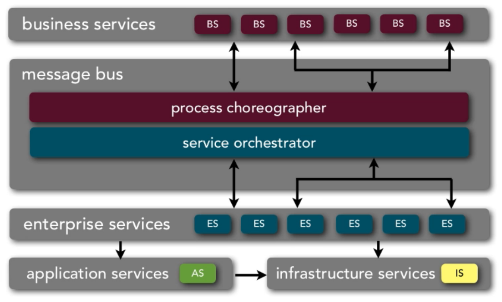

# Service-Oriented (SOA)

***

+ [**Business Services**](#business-services): Abstract services
                         Each service is standalone
+ [**Enterprise Services**](#enterprise-services): Things that are implemented based on spec
+ [**Message Bus**](#message-bus): What ties both of the above sevices together
  - **Process Choreographer**: Responsible for orchestrating the *Business Services*
                               This can vary in granularity (i.e. coarse PC isn't going to require a lot of orchestration)
                               Basically doing choreography against the *Business Services*
  - **Service Orchestrator**: What says, "This *Business Service* requires these *Entreprise Service*s"
                              Generally not a 1-to-1
                              Is what links the 1-to-many relationship between a *Business Service* and the *Enterprise Service*s
+ [**Application Services**](#application-services):
+ [**Infrastructure Services**](#infrastructure-services)

To help differentiate between a *Business Service* and an *Enterprise Service*, to ask yourself is:
> What do you do as a business here? What the business **does** is a *Business Service*...

For example, if working for a recruitment agency, the company might **Process a Timesheet**... this is a *Business Service*

...to process a timesheet, you need a customer who that timesheet belongs to so an *Enterprise Service* might be to **Create a Customer**

**Granularity** is the hardest part of this pattern...

***

## Components

### Services

#### Business Services

+ Core to SOA...

| Key         | Value                                            |
|:------------|:-------------------------------------------------|
| type        | abstract										 |
| owner       | business users                                   |
| granularity | course-grained                                   |
| scope       | enterprise-level								 |
| notes       | contains; name, inputs, ouputs, & process flow   |
|             |                                                  |
|             | independent of any technical implementation or   |
|             | protocol                                         |
|             |                                                  |
|             | represented in BPEL, WSDL, etc...                |

##### Business Service Examples
+ ProcessClaim
+ ExecuteTrade
+ PlaceOrder

***

#### Enterprise Services

| Key         | Value                                            |
|:------------|:-------------------------------------------------|
| type        | concrete										 |
| owner       | architect/share services team                    |
| granularity | course-grained *(not as broad as BS but still course)* |
| scope       | enterprise-level								 |
| notes       | custom or vendor implementation                  |
|             |                                                  |
|             | 1-to-1 or 1-to-many relationship with BS         |

##### Enterprise Service Examples

+ CreateCustomer
+ CalculateQuote
+ CheckCompliance

***

#### Application Services

| Key         | Value                                            |
|:------------|:-------------------------------------------------|
| type        | concrete										 |
| owner       | application development team                     |
| granularity | fine grained *(specific to particualar part of system)* |
| scope       | application-level								 |
| notes       | bound to a specific application context; generally not shared                  |
|             |                                                  |
|             | used for validation, db query & updates          |

##### Application Service Examples

+ addDriver
  <small><i>If processing a timesheet, need to add the resource it is associated to</i></small>
+ addVehicle
+ getInventoryCount

***

#### Infrastructure Services

| Key         | Value                                      |
|:------------|:-------------------------------------------|
| type        | concrete								   |
| owner       | application development team               |
| granularity | fine grained                               |
| scope       | enterprise-level						   |
| notes       | supports application & enterprise services |
|             |                                            |
|             | implements non-business functionality      |

##### Infrastructure Service Examples

+ writeAuditLog
+ checkUserAccess
+ writeErrorLog

***

### Other

#### Message Bus

Has responsibility for the following things: 

- Process Choregraphy
- Service Orchestration
- Service Registry
  <small><i>As is bridging an abstract name to something that is implemented so it needs to know where to find that 'thing'...</i></small>
- Protocol transformation
  <small><i>Have ES' written in different languages? PT does that</i></small>
- Message enhancement
  <small><i>Changes data of message</i></small>
- Message transformation
  <small><i>Changes format of message (JSON, XML, Java Object...)</i></small>

***

### Considerations

+ Good pattern for understanding & implementing business processes & services
+ Very high level of complexity
+ Difficult to implement due to; complex tools, hype, miconceptions, & heavy business user involvement
+ Good patten for large, complex, heterogeneous businesses that have a large number of common services *(i.e. insurance)*
