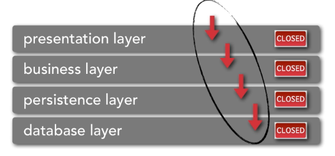
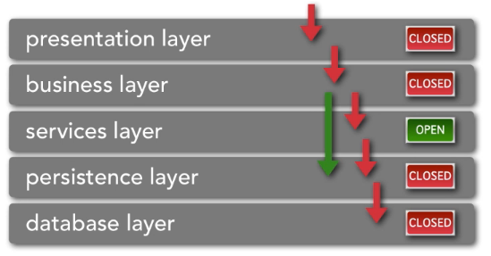

# Traditional Layered

### Closed Layered Architecture

 

##### Points

+ *Closed*: All these layers have the word **Closed** on them, this means that data has to pass through all levels to get where it wants to go, there is no skipping layers. This is a *'Closed Layered Architecture'*

    For example, to get from the *Business Layer* to the *Database Layer*, I **HAVE** to go through the *Persistence Layer*

+ *Data flow*: All data/requests flow **down**, never up. For example, the *Database Layer* would **never** make a request to the *Business Layer*

##### Advantages

+ Separation of concerns

  (i.e. *Presentation Layer* has components relating to UI... *Business Layer* has components relating to business rules/logic)

+ Layers of isolation

  (i.e. if I change the db from MySQL to Oracle, what in the architecture changes?
    &nbsp; definitely the *Database Layer* & **sometimes** the layer above
    &nbsp; but *Business Layer* does not care about what db we are talking to or whether we are even talking to a db at all...
    &nbsp; also, layers below do not know/care what is happening on the layers above)

### Open Layered Architecture

 

##### Points

+ *Open*: The *Service Layer* has the word **Open** on it meaning it is *optional* and that the *Business Layer* may/may not pass through this layer to get to the *Persistence Layer*

### Example

 

### Considerations

+ Good general purpose architecture
+ Easy to implement, test, & govern
+ Good starting point for most systems
+ Not always optimised for specific business drivers

  For example, would not implement in a typical trading application as will not get performance & scalability required